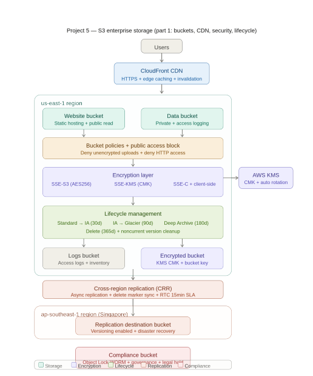
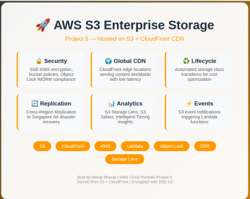
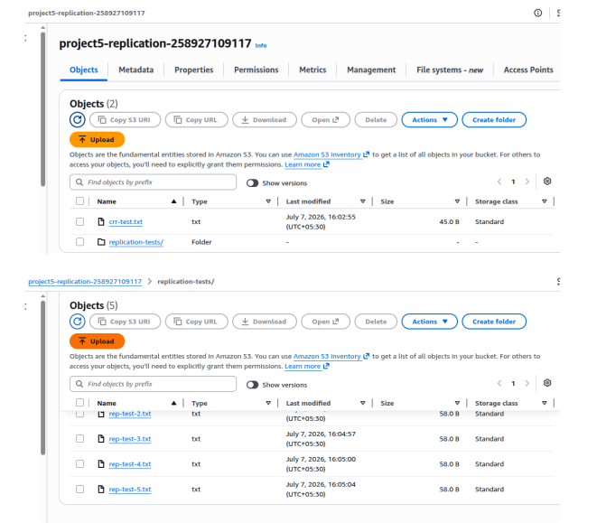

# Project 5: S3 Enterprise Storage, Security and Data Analytics

## 🎯 Objective

The first step establishes the storage foundation for the project by creating multiple Amazon S3 buckets, each designed for a specific enterprise use case such as website hosting, secure data storage, disaster recovery, encryption, compliance, and logging.
 
 Here is the plan What we're building:

| Phase | Description |
|-------|-------------|
| 🌐 Website | Static Website Hosting |
| ☁️ CDN | S3 + CloudFront (HTTPS) |
| 🔐 Security | Bucket Policies, ACLs, Public Access Block |
| 💰 Lifecycle | Standard → IA → Glacier |
| 🌍 Replication | Mumbai → Singapore |
| ⚡ Events | S3 → Lambda |
| 🔒 Encryption | SSE-S3, SSE-KMS, SSE-C, Client-Side |
| 🛡️ Compliance | Object Lock |
| 📦 Operations | Batch Operations |
| 📊 Analytics | S3 Select, Storage Lens, Intelligent Tiering |
---
> image of Architecture

---

## 🛠️ Implementation

Steps we will follow:
- Step 1 — Create S3 Buckets
- Step 2 — Static Website Hosting with CloudFront
- Step 3 — Bucket Policies and Access Control
- Step 4 — Lifecycle Management and Storage Classes
- Step 5 — Cross-Region Replication (CRR)
- Step 6 — S3 Event Notifications with Lambda
- Step 7 — Advanced Encryption (SSE-S3, SSE-KMS, SSE-C)
- Step 8 — Object Lock (WORM)
- Step 9 — S3 Batch Operations
- Step 10 — S3 Analytics (Select, Storage Lens, Intelligent-Tiering)

---

## 📸 Screenshots

## steps 1: Create S3 Buckets
We need multiple S3 buckets for different purposes — each with different configurations. Each bucket serves a different purpose with different security, replication, and lifecycle requirements. Mixing everything in one bucket makes management complex.

1. project5-website-258927109117 - Static website hosting
2. project5-data-258927109117 - Main data storage
3. project5-replication-258927109117 - CRR destination (Singapore)
4. project5-encrypted-258927109117 - Advanced encryption practice
5. project5-compliance-258927109117 - Object Lock WORM storage
6. project5-logs-258927109117 - S3 access log

## Step 2: Static Website Hosting with CloudFront
S3 can serve HTML, CSS, JavaScript files directly as a website without any web server. Perfect for portfolios, landing pages, documentation sites.

### Without CloudFront
1. All requests hit S3 in us-east-1
2. Slow for users in India, Europe, Asia
3. S3 URL only (http)
4. Pay for every S3 request
5. No DDoS protection

### With CloudFront
1. Requests served from nearest edge location
2. Fast everywhere in the world
3. Custom domain + HTTPS
4. CloudFront caches fewer S3 requests
5. AWS Shield Standard built-in

> Image of cloud front webpage

---

## Step 3 — Bucket Policies and Access Control

JSON documents attached to S3 bucket defining who can do what with the bucket and its objects. Resource-based policy — attached to the resource, not the user.

What is Public Access Block: 4 settings that override bucket policies and ACLs to
prevent any public access. Acts as an extra safety net.

Why Public Access Block exists: Many S3 data breaches happened because
developers accidentally made buckets public. AWS added this as an account-level
and bucket-level override.

---

## Step 4 — Lifecycle Management and Storage Classes

What are S3 Storage Classes: Different tiers of S3 storage with different costs,
availability, and retrieval times.

What are Lifecycle Rules: Automatically move objects between storage classes or
delete them based on age — saving cost without manual work.

Why Lifecycle Rules: You don't want to pay Standard pricing for old log files.
Lifecycle automatically moves them to cheaper tiers.

steps to apply :
1. Go to S3 → project5-data-258927109117
2. Click "Management" tab
3. Click "Create lifecycle rule"

#### Lifecycle Management:

- project5-data-life - cycleStandard→IA(30d)→Glacier(90d)→Deep Archive(180d)→Delete(365d)
- project5-versions  - cleanupNoncurrent→IA(30d)→Glacier(60d)→Delete(90d)
- project5-intelligen Immediate Intelligent-Tiering t-tiering
- Storage class uploads tested - Standard, IA, Glacier

---

## STEP 5 — Cross-Region Replication (CRR)

What is Cross-Region Replication: CRR automatically copies every object
uploaded to your source bucket into a destination bucket in a different AWS region.
Happens asynchronously within seconds to minutes.

> Replication img

---

## STEP 6 — S3 Event Notifications with Lambda

What are S3 Event Notifications: S3 automatically sends notifications when
specific events happen — object created, deleted, restored from Glacier.

Why use Event Notifications: Enables event-driven architecture — automatically
trigger processing when files arrive. No polling needed.

S3 Event Notification targets:
| Target | Use Case |
|--------|----------|
| Lambda | Process file immediately|
| SQSQueue | processing for batch handling |
| SNS  | Fan-out to multiple subscribers |
|   EventBridge | Route to multiple targets with filtering |

What happens if not used: Application must constantly poll S3 to check for new
files — inefficient, delayed, costs money.

---

## STEP 7 — Advanced Encryption

What is S3 Encryption: Encrypting data so only authorized parties can read it. S3
supports encryption at rest (stored data) and in transit (data moving over network).

- Type 1 — SSE-S3 (Server-Side Encryption with S3 Keys)
- Type 2 — SSE-KMS (Server-Side Encryption with KMS Keys)
- Type 3 — SSE-C (Server-Side Encryption with Customer Keys)
- Type 4 — Client-Side Encryption

---

## STEP 8 — Object Lock (WORM Storage)

What is Object Lock: Object Lock prevents objects from being deleted or
overwritten for a fixed amount of time or indefinitely. Called WORM — Write Once
Read Many.

Why use Object Lock:
| Industry | Requirement |
|----------| ------------|
| Finance | SEC Rule 17a-4 requires immutable records for 6 years |
| Healthcare | HIPAA requires medical records preserved unchanged |
| LegalCourt | records cannot be altered |
| Government | Audit logs must be tamper-proof |

---

## STEP 9 — S3 Batch Operations

What is S3 Batch Operations: Perform large-scale operations on billions of S3 objects with a single request. Instead of writing a script that loops through objects one by one — Batch Operations handles it in parallel at massive scale.

> Batch Operation
![Batch Op] (images/steps image/batch-op.png)

---

## STEP 10 — S3 Analytics (S3 Select, Storage Lens, Intelligent-Tiering)

What is S3 Select: Query data INSIDE S3 objects using SQL — without downloading the entire file. Supports CSV, JSON, and Parquet formats.

## ✅ Verification

Successfully verified:

- Six Amazon S3 buckets created.
- Versioning enabled where required.
- Encryption configured successfully.
- Object Lock enabled for compliance bucket.
- Server Access Logging enabled.
- Replication destination bucket created in a different AWS Region.

---

#### I completed this project win 2 way:

1. By AWS console & AWS CLI.
2. Use of Terraform.

## 💡 Key Learning

This step demonstrates how enterprise environments separate workloads into dedicated Amazon S3 buckets rather than storing everything in a single bucket. Proper bucket design improves security, simplifies management, enables compliance, and supports disaster recovery strategies.

---